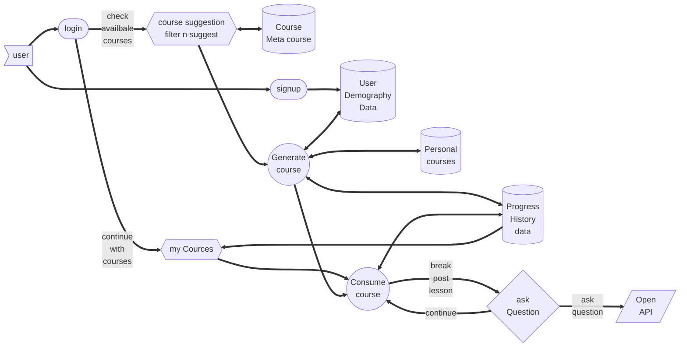
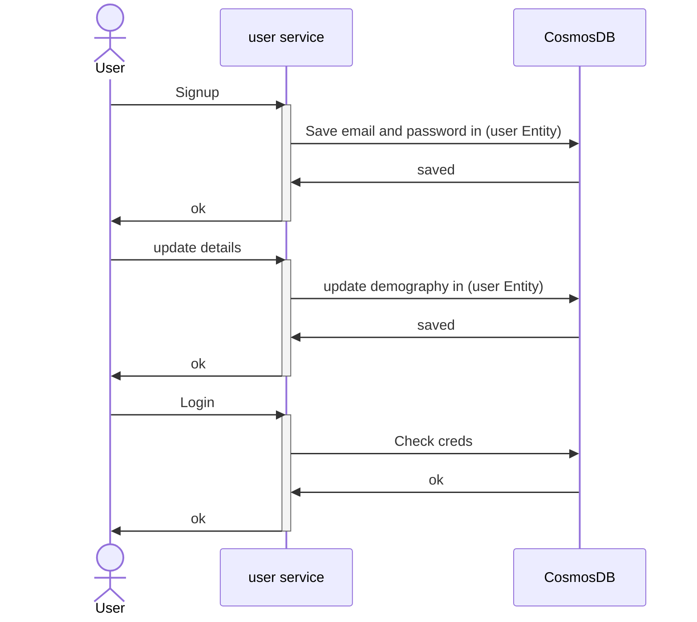
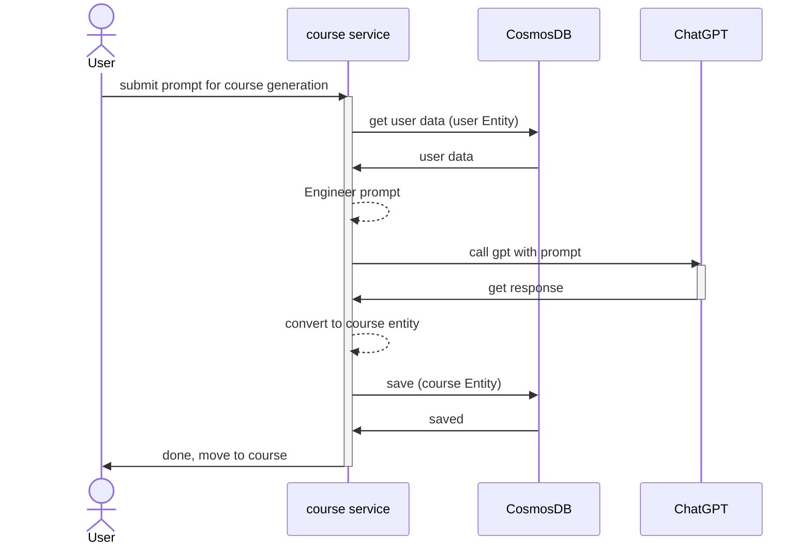
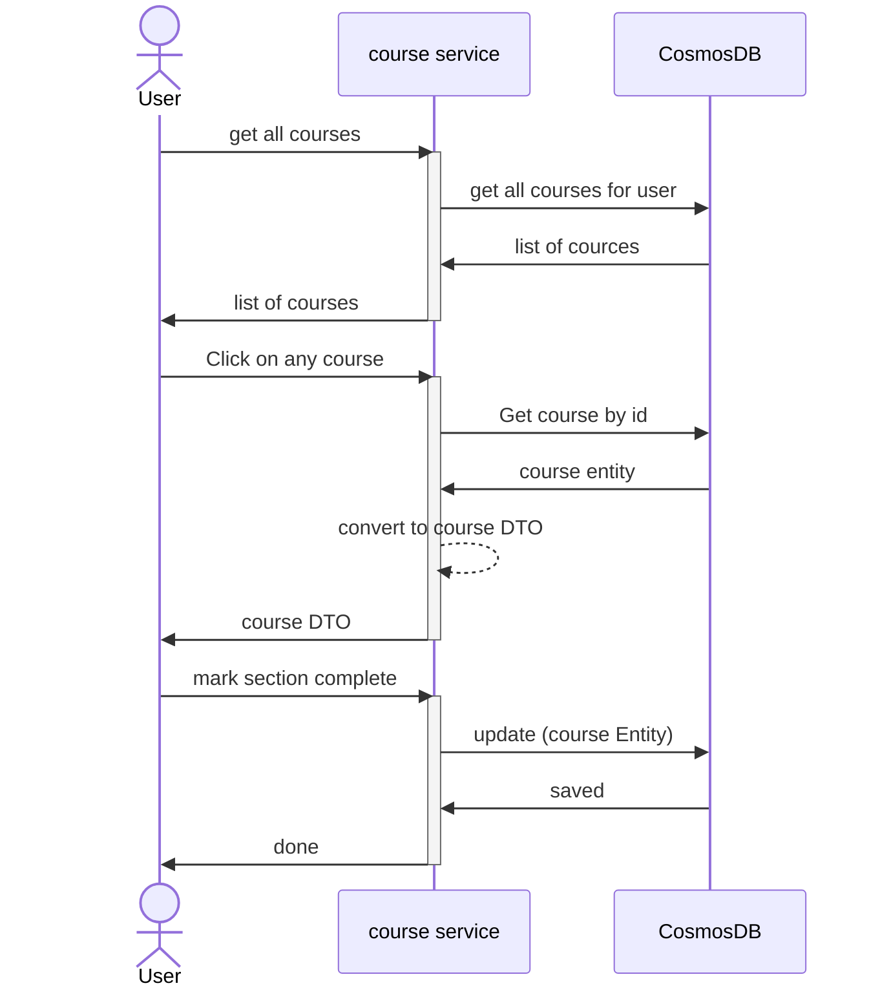

# Learn Via AI

## Architecture
Below is the architecture of the project.

```mermaid
flowchart LR

    user>user]

    userDb[(User \n Demography\n Data)]
    courseDb[(Course \n Meta course)]
    progressDb[(Progress \n History \n data)]
    personalCouseDb[(Personal \n courses)]

    signup([signup])
    login([login])

    courses{{course suggestion\nfilter n suggest}}

    myCourses{{my Cources}}

    generate((Generate\ncourse))

    consume((Consume\ncourse))

    feedback{ask\nQuestion}

    openAPI[/Open\nAPI/]

    user==>signup
    signup==>userDb

    user==>login

    login== continue \n with \n courses==>myCourses
    progressDb==>myCourses
    myCourses===>consume

    login== check \n availbale\n courses==>courses
    courses<==>courseDb
    courses==>generate
    generate<==>userDb
    generate<==>progressDb
    generate<===>personalCouseDb

    generate==>consume
    consume<===>progressDb

    consume== break \n post \n lesson ===>feedback
    feedback==>|continue|consume
    feedback==>|ask\nquestion|openAPI

    
```

## Login / signup  Flow

```mermaid
sequenceDiagram
    actor U as User
    participant US as user service
    participant db as CosmosDB
    
    U->>US: Signup
    activate US
    US->>db: Save email and password in (user Entity)
    db->>US: saved
    US->>U: ok
    deactivate US
    
    U->>US: update details
    activate US
    US->>db: update demography in (user Entity)
    db->>US: saved
    US->>U: ok
    deactivate US
    
    U->>US: Login
    activate US
    US->>db: Check creds
    db->>US: ok
    US->>U: ok

    deactivate US
```

## Course generation Flow

```mermaid
sequenceDiagram
    actor U as User
    participant com as course service
    participant db as CosmosDB
    participant gpt as ChatGPT

    U->>com: submit prompt for course generation 
    activate com
    com->>db: get user data (user Entity)
    db->>com: user data
    com-->>com: Engineer prompt

    com->>gpt: call gpt with prompt
    activate gpt
    gpt->>com: get response
    deactivate gpt

    com-->>com: convert to course entity
    com->>db: save (course Entity)
    db->>com: saved
    com->>U: done, move to course

    deactivate com
```

## Course management Flow

```mermaid
sequenceDiagram
    actor U as User
    participant com as course service
    participant db as CosmosDB

    U->>com: get all courses
    activate com
    com->>db: get all courses for user
    db->>com: list of cources
    com->>U: list of courses
    deactivate com

    U->>com: Click on any course
    activate com
    com->>db: Get course by id
    db->>com: course entity
    com-->>com: convert to course DTO
    com->>U: course DTO
    deactivate com

    U->>com: mark section complete
    activate com
    com->>db: update (course Entity)
    db->>com: saved
    com->>U: done

    deactivate com
```
