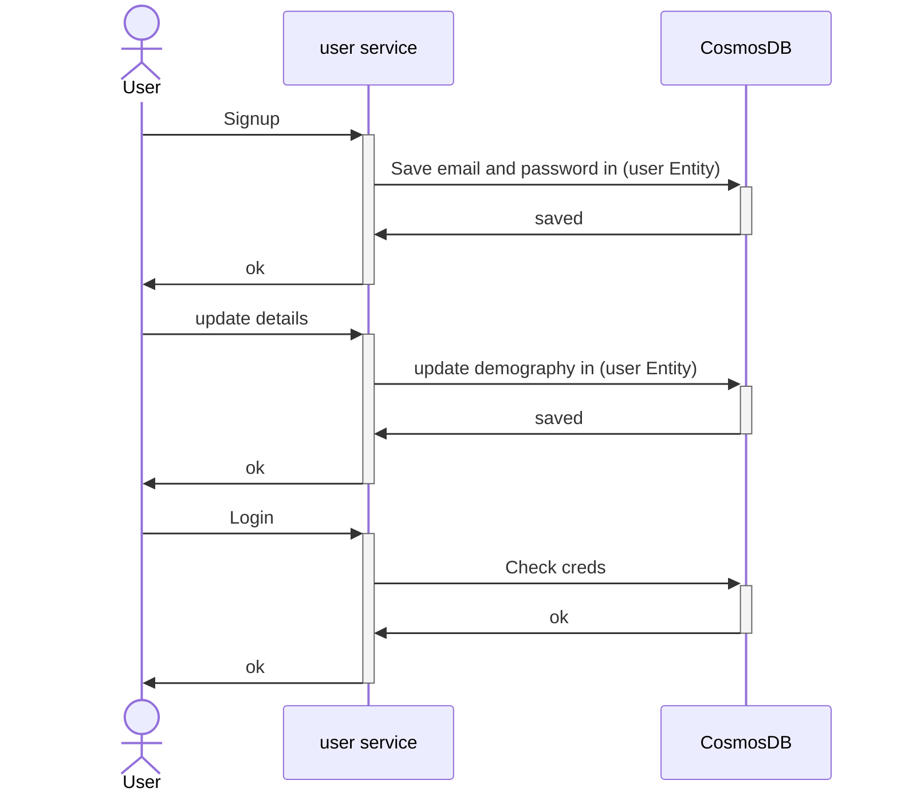
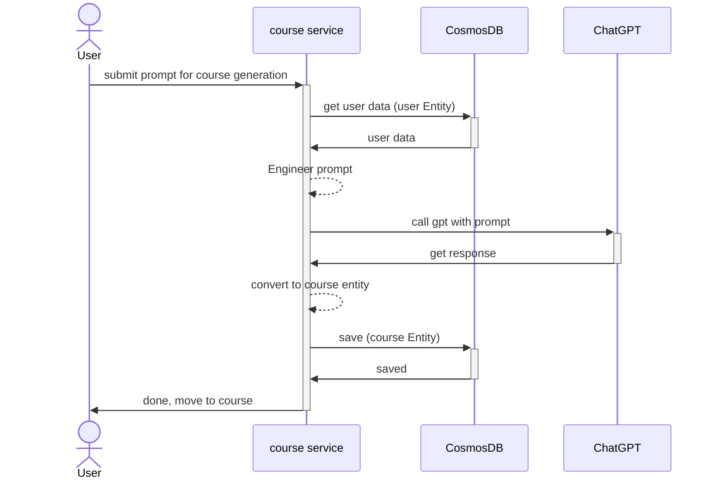
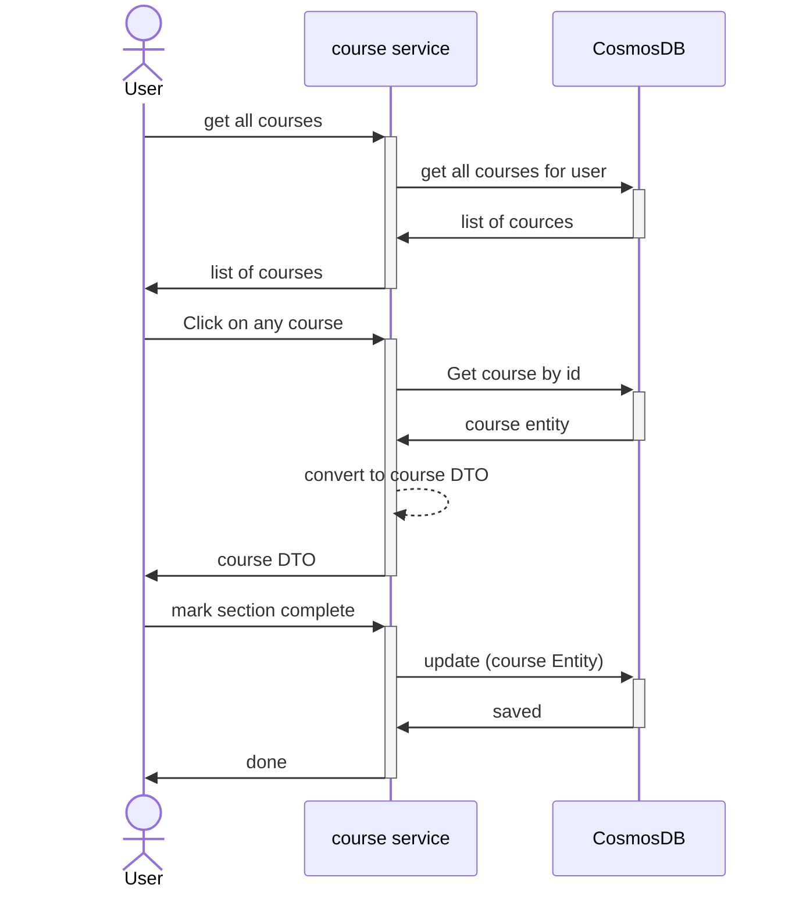
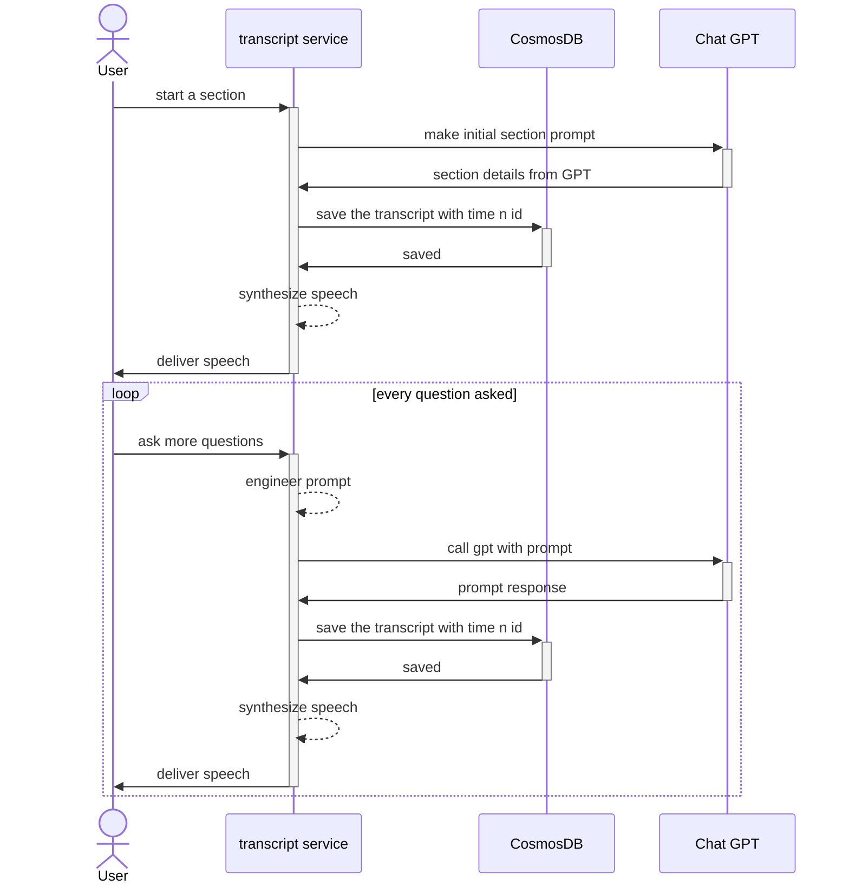
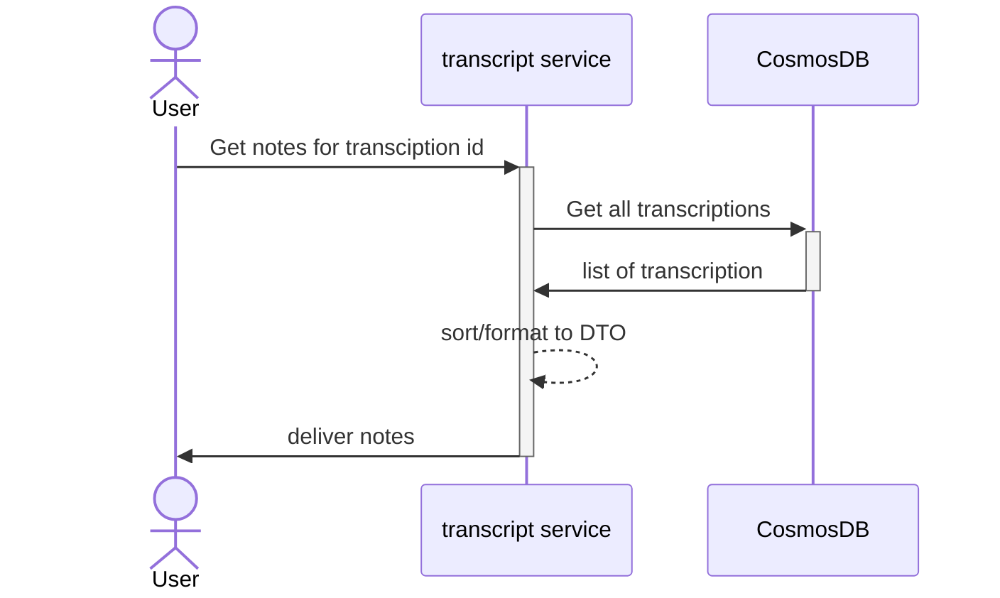

# Learn Via AI

## Architecture
### * Change required in below diagram *

## Login / signup  Flow

## Course generation Flow

## Course management Flow

## Consume course flow

## Get Notes Flow

